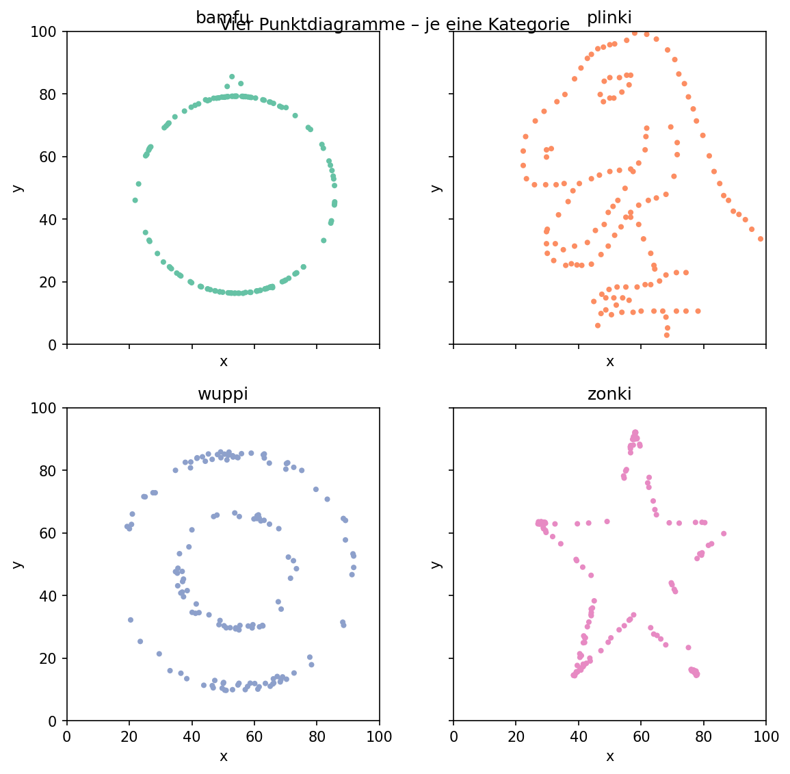

# Mentor-Guide: Die Daten-Höhle (Exercise 01 – Data Cave)

Dieser Leitfaden hilft Mentor:innen, die Übung „Daten-Höhle“ sicher und wirkungsvoll anzuleiten.

## Ziel der Übung (Learning Goals)

- Erkennen: Visualisierung macht verborgene Muster in Daten sichtbar (Datasaurus-Prinzip).
- Anleiten statt Programmieren: Kinder steuern eine KI mit klaren Prompts (Prompting-Grundlagen).
- Daten-Exploration: Von „Ein paar Zeilen zeigen“ bis zur passenden Darstellung (Scatter-Plot, Achsenverhältnis).
- Kritisches Denken: Nicht raten – Beweise durch Visualisierung, erst dann Entscheidung.

## Story in Kürze (für Mentor:innen)

Die Kinder wachen in einer „Daten-Höhle“ auf. Eine verschlossene Tür hat vier Kristall-Knöpfe: `Katze`, `Hund`, `Dino`, `Maus`. An der Wand meldet sich die KI-Helferin „Nova“: In einem Datensatz steckt ein Tier verborgen, das zu einem Knopf passt. Nur ein Versuch! Die Kinder sollen mit Hilfe der KI herausfinden, welches Tier in den Daten steckt, und anschließend den richtigen Knopf nennen. Der Datensatz ist in `exercises/01-data-cave/dataset/base-data/datasaurus.csv` enthalten und enthält u. a. die berühmte „Dino“-Form.

Hinweis: In den Daten steckt die Dino-Silhouette (Datasaurus). Ziel ist, dass die Kinder das Muster mit einer passenden Visualisierung entdecken – nicht zu raten.

## Material & Setup

- Dateien:
  - `exercises/01-data-cave/dataset/base-data/datasaurus.csv` (Rohdaten)
  - `exercises/01-data-cave/dataset/datasaurus-parsed.csv` (falls vorhanden/generiert)
- Tool: Ein KI-Chat (z. B. Open WebUI, beliebiger LLM), der Code ausgeben und einfache Plots erzeugen kann.
- Optional: Browser/Notebook/Online-Editor, in dem der von der KI erzeugte Code ausgeführt werden kann.

## Ablaufvorschlag (25–40 Minuten)

1. Einstieg (5 Min)

- Frage: „Was könnte in Zahlen versteckt sein?“ – Sammle Ideen. Erkläre, dass Visualisierung Muster sichtbar macht.
- Grenze den Auftrag ein: „Wir haben nur einen Versuch – wir brauchen Beweise!“

1. Daten kennenlernen (5–10 Min)

- Kinder geben Nova/der KI Prompts wie:
  - „Zeige mir 5–10 Zeilen aus der Datei `datasaurus.csv` und erkläre kurz die Spalten.“
  - „Welche Spalten sind geeignet, um einen Scatter-Plot zu zeichnen?“
- Erwartung: Spalten `x`, `y` und eine Gruppenspalte `dataset` sind enthalten.

1. Visualisieren (10–15 Min)

- Ziel: Scatter-Plot `x` gegen `y` mit Aspektverhältnis 1:1, Punkte klein, Achsen sichtbar.
- Beispiel-Prompts:
  - „Lies die Datei `exercises/01-data-cave/dataset/base-data/datasaurus.csv` ein und zeichne einen Scatter-Plot von `x` vs. `y`. Nutze ein Achsenverhältnis von 1:1 und kleine Punkte.“
  - „Falls es mehrere Gruppen in der Spalte `dataset` gibt: Filtere zunächst auf `dataset == \"dino\"` und zeige den Plot.“
  - „Drehe keine Achsen und verwende keine Linien – nur Punkte. Erkläre, was du siehst.“
- Erwartung: Die Silhouette eines Dinos wird sichtbar.

1. Entscheidung & Reflexion (5–10 Min)

- Frage: „Welchen Knopf drückt ihr – und warum?“
- Besprecht: Warum hätte eine andere Darstellung (z. B. nur Mittelwerte) das Muster verschleiert? Was lernen wir über Datenrepräsentation?

## Beispiel-Übersicht der Plots

Die folgende Übersicht zeigt alle Daten in vier unterschiedlichen Diagrammen – hilfreich, um die Bedeutung der richtigen Darstellung zu veranschaulichen:

## Tipps für Mentor:innen (Didaktik & Coaching)

- Fokus auf Denken, nicht auf Tooling: Kinder geben der KI klare, kurze Anweisungen. Ermutige zum iterativen Prompten.
- Sicherheit geben: Es ist okay, wenn der erste Plot „falsch“ aussieht. Leite zum Verbessern an (Achsenverhältnis, Punktgröße, Filter nach `dataset`).
- Nicht raten lassen: „Nur ein Versuch“ ist ein Story-Element, um Begründungen statt Bauchgefühl zu fördern.
- Sichtbarkeit des Musters:
  - Aspektverhältnis 1:1, Achsen nicht automatisch strecken.
  - Punkte klein, ggf. `alpha` leicht erhöhen, keine Linien oder Regressionen.
  - Falls viele Gruppen vorhanden sind: erst Gruppe „dino“ filtern, dann plotten.
- Prompt-Hygiene:
  - Konkrete Datei-Pfade nennen.
  - Erwähne gewünschtes Ergebnisformat (z. B. PNG/SVG) und Plot-Parameter.
  - Um Erklärung bitten: „Erkläre kurz, was im Plot zu sehen ist.“
- Rollenklärung: Die KI darf programmieren – die Kinder steuern mit Prompts. Fehlt eine Laufumgebung, kann die KI den Plot auch als SVG-Code erzeugen.

## Häufige Stolpersteine & schnelle Lösungen

- Plot sieht „gestaucht“ aus: „Bitte setze das Achsenverhältnis auf 1:1 und gleiche Skalen für x und y.“
- Zu große Punkte, Muster unklar: „Verwende kleine Punkte (z. B. Größe 5) und kein Verbinden der Punkte.“
- Zu viele Gruppen gleichzeitig: „Filtere auf `dataset == \"dino\"` und zeichne nur diese Punkte.“
- Datei nicht gefunden: Pfad exakt angeben (siehe oben); ggf. Datei in den Arbeitsordner kopieren.
- KI erklärt, aber plottet nicht: Nach Plot ausdrücklich fragen, gewünschtes Format nennen.

## Erweiterungen (wenn Zeit bleibt)

- Weitere Formen entdecken: Andere Werte in `dataset` (z. B. `star`, `circle`, `x_shape`, `bullseye`) filtern und visualisieren – Überraschung: Gleiche Grundstatistiken, sehr unterschiedliche Bilder.
- Vergleich: Zeige Mittelwert/Varianz vs. Plot – warum Zahlen allein nicht genügen.
- Prompting-Vertiefung: Kinder formulieren „gute“ vs. „vage“ Prompts und vergleichen Ergebnisse.

## Erfolgskriterien (Abhaken)

- Kinder können beschreiben, warum Visualisierung wichtig ist („Representation matters“).
- Es wurde ein korrekter Scatter-Plot (1:1) erstellt und das Dino-Muster erkannt.
- Entscheidung für den Knopf ist begründet (nicht geraten): „Dino“.

## Mini-Spickzettel (Prompts zum Kopieren)

- „Zeige mir 10 Zeilen aus `exercises/01-data-cave/dataset/base-data/datasaurus.csv` und erkläre kurz die Spalten.“
- „Erzeuge einen Scatter-Plot von `x` gegen `y` mit Achsenverhältnis 1:1, kleinen Punkten, ohne Linien.“
- „Filtere auf `dataset == \"dino\"` und zeichne nur diese Punkte.“
- „Beschreibe, welches Muster im Plot sichtbar ist.“

---
Kurzfazit für Mentor:innen: Die Kinder sollen entdecken, dass man Muster in Daten oft erst durch die richtige Darstellung erkennt. Das motiviert zu guten Prompts, sorgfältiger Datenexploration und begründetem Entscheiden – statt Raten.
