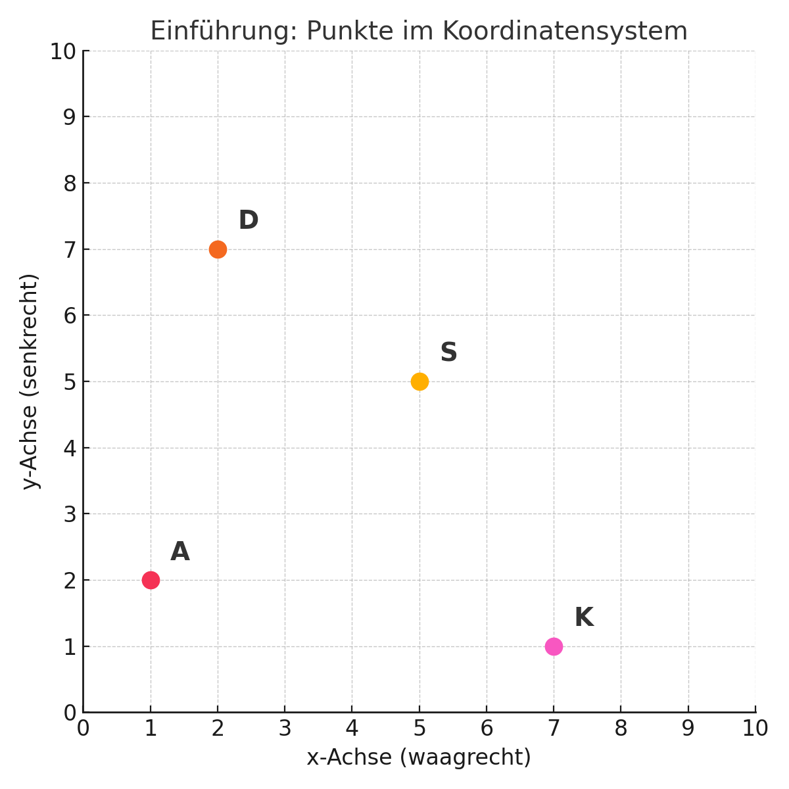

# Datasaurus 

### 🗺️ Das Geheimnis der komischen Karte
Hallo kleiner Entdecker / kleine Entdeckerin!
Oh nein! Du hast dich im Dschungel verirrt – aber keine Sorge, du bist nicht allein.
Du hast eine geheime Karte bei dir. Sie sieht ziemlich seltsam aus – lauter Buchstaben und Zahlen!
Du verstehst sie noch nicht? Kein Problem! Diese Karte zeigt dir versteckte Figuren, die dir helfen können, wieder nach Hause zu finden. 🏡✨

### 🔍 Deine Aufgaben
Mit Hilfe der geheimen Karte kannst du besondere Figuren entdecken:
Vielleicht findest du den Datasaurus, der dich im Wald beschützt. 🦖
Da gibt es auch ein magisches Auge, das alles sehen kann – es bringt dich blitzschnell in Sicherheit, wenn Gefahr droht. 👁️
Und wenn du den Kreis findest, hast du eine Schutzblase um dich – kein Monster kommt da rein! 🛡️
Aber am wichtigsten ist der Stern 🌟 den dieser zeigt dir den weg nachhause egal wie dunkel es ist. 
Ich bin mir sicher wenn du dann noch eine zweite Figur endeckst das du sicherlich bald wieder daheim bist!

### 🦊 Dein Freund der schlauer Fuchs
Aber keine Angst – du bist nicht ganz allein unterwegs!
Du hast einen schlauen Fuchs dabei. Dieser Fuchs ist besonders klug und kann dir helfen, die Karte zu lesen und die Figuren zu finden.
Aber pass auf:
Der Fuchs braucht genaue Hinweise von dir.
Wenn du ihm nicht genug sagst, macht er manchmal Fehler.
Und wenn du ihn mit zu vielen Fragen überforderst, kann es sogar sein, dass er dir irgendwas erzählt, nur um Ruhe zu haben! 🙊
Aber keine Sorge – ich helfe dir, richtig mit dem Fuchs zu sprechen, um zumindest mal den Stern zu finden!
Dann werdet ihr zusammen den Weg nach Hause schaffen! 💫🦊

### Fangen wir an unseren Stern zu suchen 👀🔍

Ganz am Anfang! Wenn du nicht weiter kommst kannst du immer deine Mentoren frage, diese helfen dir immer gerne weiter! 

Hier kannst du dem Fuchs schreiben 💬

//TODO UI Bild 

Der Fuchs hat deine Karte bereits gesehen! 🎉

Jetzt kannst du mal Anfangen deinen Freund zu der Karte zu befragen :) 

Hier sind ein paar Beispiele: 
-   Ist dir schon was an der Karte aufgefallen? 

-  Hallo kennst du meine Karte schon? 

- Kannst du mir einen Auschnitt dieser Karte zeigen? 

-  Weist du was diese Karte bedeutet? 

- ...

Das sind ein paar gute Beispiele wie du Anfangen kannst mit hilfe von deinen Freund die Karte zu analysieren! 🎓🗺️

Und? hast du schon ein paar Daten gesehen? oder eine Vermutung? 

Falls nicht habe ich wieder ein paar Fragen für dich die du den Fuchs stellen kannst :)
- Kannst du mir den Inhalt der zeigen?

- Erkennst du schon einen Zusammenhang? Wenn ja welchen? 

-  was könnten wir als nächtes tun? 

## 💡 Tipp: Es steht immer ein Wort vor den folgenden zwei Zahl! Villeicht ein Name für etwas? Wir suchen den Stern! 

Hat dir der Tipp was geholfen? Du kannst ihn sonst auch gerne genauso so deinen Freund schreiben! Villeicht versteht er den Tipp und kann dir sofort helfen 😁

Nah? schon was gefunden? Ich habe weitere Beispiele für dich die du deinen Freund fragen kannst ;) 
-  Was kann ich jetzt mit den Zahlen machen? 

- Was könnten die Zahlen darstellen ? 

## 💡 Tipp: Ein Punkt auf einer Karte besteht aus zwei Zahlen! 

Ich bin mir sicher der Tip hat dir und den Fuchs geholfen;) So jetzt weißt du ja schon was die Zahlen bedeuten, und der Name davor, du bist ja schon ein richtiger Profi!👌🏼 

Jetzt Habe ich wieder ein paar Hilfreiche Fragen für dich die du stellen kannst! 
- Was kann ich jetzt mit diesen Punkten machen? 

- Was würdest du jetzt mit diesen Punkten machen? 

- Was denkst du bedeuten diese Punkte? 

- Inwiefern kann mir das helfen meinen Stern zu finden? 

## 💡Tipp: In einen Koordinaten System kann man Punkte ganz genau einzeichnen! 

Du weist nicht oder nicht mehr was ein koordinaten System genau ist? Keine sorge😇

## 🗺️ Was ist ein Koordinatensystem?
Ein Koordinatensystem ist wie eine Schatzkarte mit vielen kleinen Kästchen.
Damit kannst du genau sagen, wo etwas ist.
Jeder Punkt auf der Karte hat zwei Zahlen:
Die erste Zahl (x) sagt, wie weit du nach rechts gehst.
Die zweite Zahl (y) zeigt, wie weit du dann nach oben gehst.
Zum Beispiel:
Der Punkt S (5, 5) bedeutet:
👉 5 Schritte nach rechts, dann 5 Schritte nach oben.
Jeder Punkt auf dem Bild hat einen Buchstaben-Namen.

Seit ihr schon weiter gekommen? 
Ganz sicher! Jetzt wirds nähmlich spannend🧐!

Euch hat hoffentlich der Tipp mit den Koordinaten System geholfen!
Weist du das der Fuchs auch was zeichnen kann für dich? 
Frag ihn doch mal ob er dir so ein Koordinatensystem erstellt und einmal alle punkte eintragt. 
Villeicht erkennst du ja was ? 

## 💡Tipp: Es steht immer etwas vor den Zahlen, die den Punkt bilden! Errinner dich ganz an den Anfang!

Erkennst du schon unseren Stern am Nachthimmel 🤩 ? 
Super!! Du hast schon einen Enorm großen Teil fertig für Heimmreise!

Suche dir eine von den restlichen 3 Figuren aus und probiere diese noch mal von Anfang an zu finden! 
Du schaffst das sicherlich auch ohne mich! 😃 Du kannst gerne Fragen die du bei unseren Stern gestellt hast jetzt genauso stellen! 

